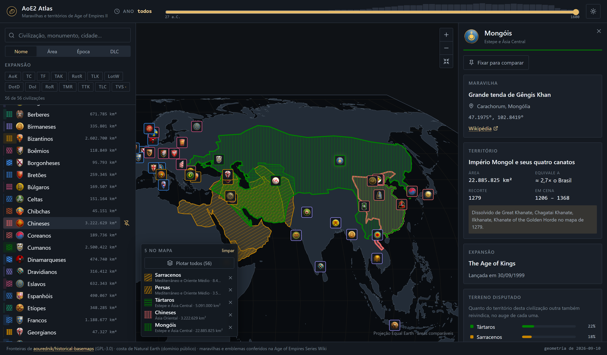
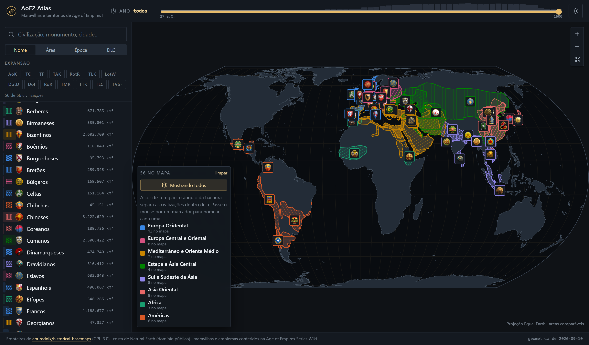

# AoE2 Atlas

Um mapa-múndi interativo das 56 civilizações de *Age of Empires II*: a maravilha de cada uma
plantada sobre o monumento real que a inspirou, e o território histórico por trás dela desenhado
em escala honesta.



> As cinco civilizações acima dividem terreno; as hachuras se cruzam onde isso acontece.

## Por que não é só mais um mapa de maravilhas

**A projeção é equivalente.** O atlas usa Equal Earth, não Web Mercator. Isso importa: em
Mercator a Escandinávia parece maior que a Índia. Se a pergunta é *"quanto chão essa civilização
segurava?"*, Mercator responde errado. Aqui o Império Mongol (22,9 milhões de km²) ocupa na tela
quarenta e duas vezes a área da Boêmia (119 mil km²), porque é isso que ele era.

**Territórios sobrepostos ficam legíveis.** Cada reino é preenchido com hachura, não com cor
sólida. Onde dois se sobrepõem as linhas se cruzam e você vê as duas cores no mesmo quilômetro
quadrado — sem o atlas precisar calcular uma única interseção em tempo de execução. O painel de
detalhes ainda traz a tabela de **terreno disputado**, com quanto do território de cada civ outra
também reivindica no auge das duas.

**Cor identifica região, textura identifica civilização.** As oito regiões usam oito matizes de
uma paleta validada para daltonismo; civilizações da mesma região se distinguem pelo ângulo da
hachura. Um filtro que muda quantos reinos estão na tela nunca repinta os que ficaram.

**Dá para plotar as 56 de uma vez.** O botão *Plotar todos* desenha tudo o que os filtros
deixaram — e, se a linha do tempo estiver parada num ano, só o que estava de pé naquele ano. Em
1198 são 34 reinos; os mongóis ainda não existem e os astecas também não. Acima de doze
territórios a legenda passa a nomear as oito regiões em vez das civilizações, porque uma lista de
cinquenta e seis linhas não é legenda de coisa nenhuma.



## Rodando

```bash
npm install
npm run dev        # http://localhost:5174
```

| Comando | O que faz |
| --- | --- |
| `npm run dev` | servidor de desenvolvimento |
| `npm run build` | `tsc -b` + build de produção (Vite 8 / Rolldown) |
| `npm run lint` | ESLint com checagem de tipos |
| `npm test` | Vitest |
| `npm run data:build` | regera a geografia em `src/data/generated` |
| `npm run data:icons` | baixa os três emblemas que o jogo ainda não traz |

## De onde vêm os dados

| O quê | Fonte | Licença |
| --- | --- | --- |
| Fronteiras históricas | [aourednik/historical-basemaps](https://github.com/aourednik/historical-basemaps) — um GeoJSON do mundo por século | GPL-3.0 |
| Costa | Natural Earth 50m, via [world-atlas](https://github.com/topojson/world-atlas) | domínio público |
| Maravilhas e monumentos | [Age of Empires Series Wiki](https://ageofempires.fandom.com/wiki/Wonder_(Age_of_Empires_II)) | CC-BY-SA |
| Emblemas das civilizações | 53 extraídos do jogo instalado; Dinamarqueses, Saxões e Varegues da wiki, porque a DLC ainda não chegou ao cliente | Microsoft / World's Edge |

`npm run data:build` baixa os arquivos de ano para `.cache/` (não versionado), recorta as
fronteiras de cada civilização, simplifica, mede a área na esfera e calcula as 136 sobreposições
entre reinos. O resultado vai para `src/data/generated/` e **é versionado** — a aplicação em si
não baixa nada.

### Curadoria

`src/data/territory-sources.ts` diz, para cada civilização, de qual ano e de quais polígonos a
fronteira é dissolvida. Seis reinos a fonte não traz e foram desenhados à mão, grosseiros de
propósito, com o motivo escrito ao lado: os três Reinos Combatentes (Shu, Wei, Wu), a dinastia
Jin dos jurchéns, a Boêmia de Carlos IV e o estado borgonhês dos Valois. O painel de detalhes
sempre diz qual dos dois caminhos produziu o contorno que está na tela.

Alguns recortes merecem nota, e todos aparecem na interface:

- **Sarracenos** usam o Califado Abássida de 800, não o Omíada — o arquivo de 700 pega os
  omíadas no meio da conquista, e a maravilha da civ (a Grande Mesquita de Samarra) é abássida.
- **Mongóis** são os quatro canatos de 1279 somados, que é o auge real do império.
- **Vikings** são Dinamarca, Noruega e Suécia em 1100, o primeiro ano em que a fonte desenha os
  três reinos separadamente; em 1000 a Suécia é um polígono degenerado e a Dinamarca-Noruega
  arrasta a Groenlândia inteira junto, o que sozinho triplicaria a área.
- **Chineses** são os Tang de 800. A maravilha, o Templo do Céu, é Ming — seis séculos depois.

Anacronismos assim são marcados na interface em vez de escondidos.

### Emblemas

Cinquenta e três emblemas saem de `widgetui/textures/menu/civs` do jogo instalado, pelo mesmo
caminho que o projeto irmão usa. Os três de *The Viking Sagas* não estão lá — a expansão só
chega em 22/09/2026 —, então `npm run data:icons` os puxa da wiki e os corta na mesma placa de
104 pixels. Assim que a DLC sair, esse script pode ser apagado e os três passam a vir do jogo
como todos os outros.

## Como está montado

```
src/
  domain/        entidades e valores, sem framework
  services/      atlas (busca e conflitos), geo (projeção), palette (cor e hachura)
  data/          catálogo curado + geometria gerada
  react/         componentes, hooks, providers, estilos
scripts/         o pipeline que gera a geografia
tests/           unit/ e feature/
```

O mapa é SVG puro com [d3-geo](https://github.com/d3/d3-geo): sem tiles, sem chave de API, sem
rede em tempo de execução. Zoom e pan movem um único grupo SVG, então os caminhos projetados são
calculados uma vez por tamanho de viewport — não por quadro. Os marcadores ficam fora desse grupo
e recebem a transformação na mão, que é o que mantém os ícones do mesmo tamanho em qualquer zoom.

## Licença

GPL-3.0-or-later. A geografia versionada é derivada de um conjunto de dados GPL-3.0, e o projeto
acompanha.
