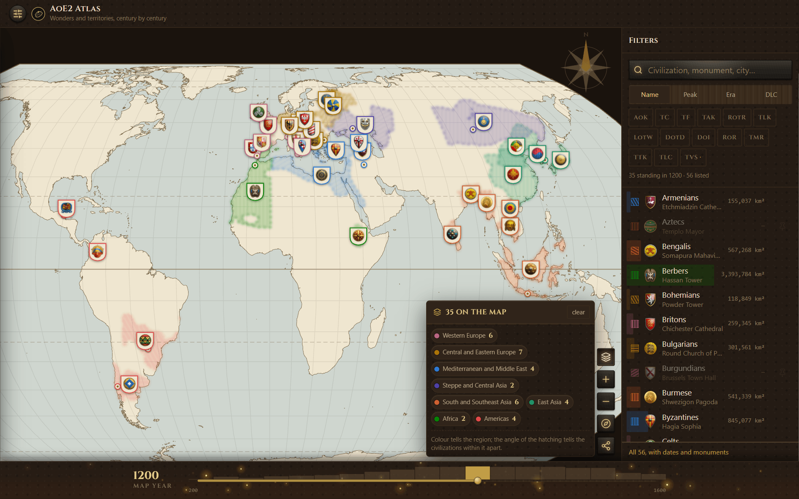
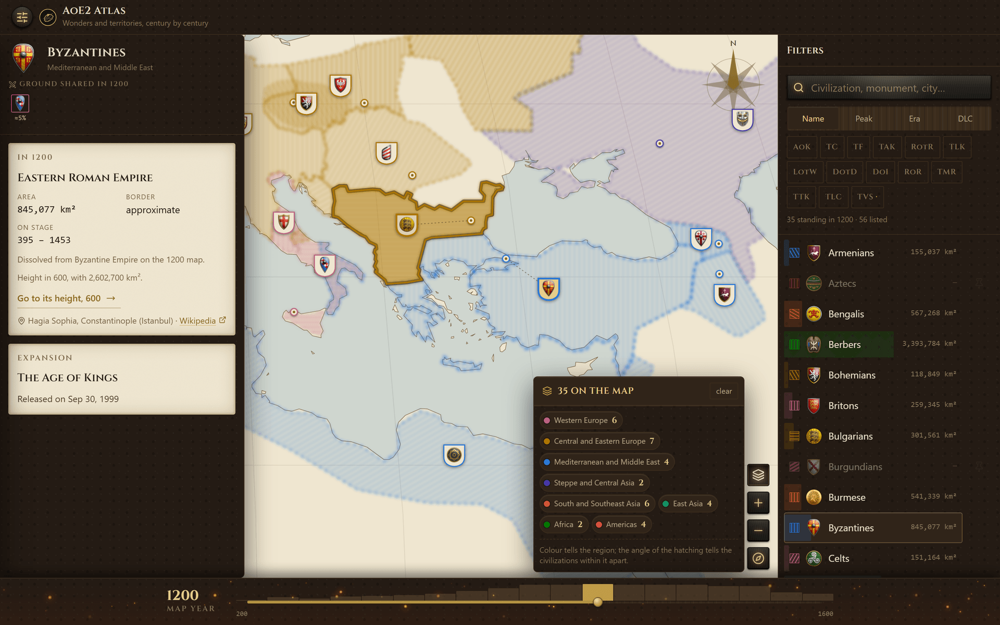

<p align="center">
  
</p>

<h1 align="center">AoE2 Atlas</h1>

<p align="center">
  <strong>The 56 civilizations of <em>Age of Empires II</em>, plotted on a map you can move
  through time.</strong><br>
  Each Wonder stands on the real monument it was modelled on, and each realm is drawn at the
  size it actually held in the year you pick.
</p>

<p align="center">
  <a href="https://github.com/giovani-freitag/aoe2-atlas/actions/workflows/ci.yml"></a>
  ·
  
  ·
  
  ·
  
  ·
  
</p>

<p align="center">
  <a href="https://giovani-freitag.github.io/aoe2-atlas/"><strong>Open the atlas →</strong></a><br>
  <sub>Drag the year and every border redraws.</sub>
</p>

<p align="center">
  
</p>

Drag the year and civilizations appear and vanish: 21 of them in 800, 35 in 1200, none of the
Aztecs before 1325, no China between 1279 and 1368 because it was the Mongol Yuan. Two realms
only ever share the screen if they shared the century.

## ✨ Features

- 🗺️ **Every civilization the game has** — all 56, through The Viking Sagas. Each emblem stands in
  its own territory, with a pin on the real monument its Wonder was modelled on. [The whole table
  is here](docs/civilizations.md): monument, city, the years each realm stood, and the ground it
  held at its widest.
- 🕰️ **Nineteen dated maps, AD 200 to 1600** — drag the year and every border redraws; a
  civilization appears only in the years it existed. The borders are cut per century from
  [aourednik/historical-basemaps](https://github.com/aourednik/historical-basemaps) and drawn as
  well as they are known: firm where the record is firm, dashed where it is a guess, faint where
  the line had to be borrowed from the century next door. The areas carry that same uncertainty,
  and say so.
- 🎨 **Overlap that means something** — two realms share the screen only if they shared the
  century, and where they met both hatchings show through. It is the reason the atlas is cut into
  centuries at all: on a single map of everyone's greatest extent, the Mongols and the Persians
  look like they are fighting over the same ground, and the Persian outline is from 600 while the
  Mongol one is from 1279.
- 🧭 **Three projections, and the atlas says what each one costs you** — Equal Earth keeps area
  and leans the shapes at the edges; Mercator keeps angle and inflates everything far from the
  equator; Natural Earth errs a little in both. Whichever you pick, not one number in the panels
  moves: every area was measured on the sphere when the data was built, all of them the same way,
  so the projection changes the drawing and never the figure you are comparing it against.

<p align="center">
  
</p>

<p align="center">
  <sub>The Byzantines in 1200: a border the panel marks <em>approximate</em> because the source
  does, and 5% of their ground shared — counted only against realms alive in the same year to
  contest it. Their height was 600, three times this size, and the panel will take you there.</sub>
</p>

## 🚀 Run it

```bash
npm install
npm run dev        # http://localhost:5174
```

| | |
|---|---|
| `npm run build` | `tsc -b` plus the production build |
| `npm run lint` | ESLint, type-aware |
| `npm test` | Vitest |
| `npm run data:build` | rebuild the 19 dated maps |
| `npm run data:icons` | fetch the three emblems the game does not ship yet |
| `npm run docs:table` | rewrite docs/civilizations.md from the data |

## 🧭 Where the data comes from

| | | |
|---|---|---|
| Historical borders | [aourednik/historical-basemaps](https://github.com/aourednik/historical-basemaps) — one world GeoJSON per century | GPL-3.0 |
| Coastline | Natural Earth 50m via [world-atlas](https://github.com/topojson/world-atlas) | public domain |
| Wonders and monuments | [Age of Empires Series Wiki](https://ageofempires.fandom.com/wiki/Wonder_(Age_of_Empires_II)) | CC-BY-SA |
| Emblems | 53 from the installed game; Danes, Saxons and Varangians from the wiki until the DLC ships | Microsoft / World's Edge |

`npm run data:build` downloads the per-year files to `.cache/`, cuts each civilization's border
out of every century, simplifies it, measures the area on the sphere and works out who shared
ground with whom. It writes a small index that always loads and 19 slices of ~30 kB that do not.

A civilization is described by **the set of names its realm goes by over the centuries** — Franks,
then Frankish Kingdom, then Carolingian Empire — and the builder resolves which of them exist in
each slice. Six realms the source does not carry are drawn by hand, deliberately rough, with the
reason written beside them; the panel always says which of the two produced the outline on screen.

The build refuses to finish if a Wonder ends up outside its own civilization's territory, which
is almost always a wrong coordinate or a wrong set of source names. A monument on the coast is
given twelve kilometres of slack, because simplifying a coastline moves the line and not the
point. Two stand outside on purpose and are listed with their reason: the Arch of Constantine is
Roman and the Huns never reached Rome, and the Kizhi Pogost is in Karelia, well beyond any
medieval Slavic border.

## 📚 Docs

- [Every civilization, its Wonder and the centuries it stood](docs/civilizations.md) — the 56 in one table, generated from the same files the map is drawn from
- [The shape of the atlas on a phone](docs/phone-layout.md) — where everything sits, and the measurements that settled it
- [Being found](docs/search-visibility.md) — what was done for search, what was deliberately not, and why
- [Changelog](CHANGELOG.md) — what shipped, release by release
- [Releases](https://github.com/giovani-freitag/aoe2-atlas/releases) — the tagged builds
- Source layout: `src/domain` (entities), `src/services` (catalogue, slices, projection, palette),
  `src/i18n` (the 17 languages), `src/react` (interface), `src/skins/age` (the theme),
  `scripts/` (the pipeline), `tests/` (unit and feature)
