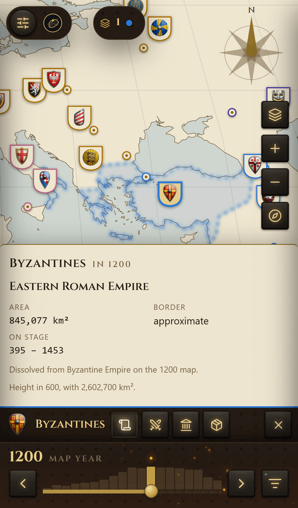

# The shape of the atlas on a phone

A map is the whole point, so nothing in this interface is allowed to sit on top of one for
longer than a reader asked it to. That single rule produced every arrangement below, and the
measurements are how each one was settled.

## Where things are

| | Phone | Desktop |
| --- | --- | --- |
| The map | the whole screen, edge to edge | the middle column |
| The year | a band at the foot, always out | a band at the foot, always out |
| What is on the map | a drawer from the right | a column on the right |
| How it is drawn | a drawer from the left | a drawer from the left |
| One civilization | a bar over the year rail, one panel at a time | a panel docked on the left |
| The legend | a pill at the head of the map, unfolding on a tap | a card in the corner |
| The atlas itself | a pill at the head of the map | a band along the top |

Three questions, three places, and the same three sides at either size. What is on the map comes
in from the right, how it is drawn comes in from the left, and when — the axis every reading on
the map is qualified by — is along the foot where a thumb already is.

Everything turns at one width, the one `useWideScreen` names. There is no second breakpoint in
the stylesheets; when there was, the legend believed it was on a desktop for two hundred and
forty pixels' worth of window while the rest of the atlas was still a phone, and the two
overlapped.

## The civilization, as a deck

Opening a civilization used to raise a sheet over the map, which answered every question at once
and hid the ground it was describing to do it. It is a bar now: the arms, the name where there is
room for it, one thumb-sized button per category, and a way out. A tap lifts that category over
the map and a second tap puts it away.

| State | Map covered |
| --- | --- |
| Bar alone | 8% |
| Contemporaries open | 23% |
| Expansion open | 26% |
| Wonder open | 32% |
| Realm open | 45% |

  

No panel may take more than a third of the screen's height; past that it scrolls. The map is
shorter than the screen — the year's band is under it — so even the longest panel, the realm's,
stops at a little under half of it, where it had been covering half the map while describing how
much ground that realm held: the one thing the reader opened it to compare against what is drawn.

The bar slides out of the year's own band and tucks back under it. The year is what everything
else is measured against, so it is the thing that casts a shadow rather than the thing covered.

## What the panels say

Two panels describe the same civilization, one docked at the side of a desktop and one over the
foot of a phone. They share their words. A copy is a promise to change both, and the second one
is the one that gets forgotten: the phone's had already lost the hand-drawn note and the
carried-border warning before they were brought together.

| Shared | Lives in |
| --- | --- |
| The realm's facts, the Wonder's, the expansion's | `civ-facts.tsx` |
| Who counts as a contemporary, and how many is too many | `contemporaries.ts` |
| The neighbours, packed as arms or named in rows | `rivals.tsx` |
| A civilization's arms | `civ-arms.tsx` and `assets.ts` |

Tapping a neighbour traces that realm and gets the panel out of the way, because "they shared
forty per cent of your ground" is a claim about a shape, and the shape is the answer.

## The year

One bar of the histogram is lit, not every bar behind it. The bars read how crowded each century
was, which is absolute for each one; lighting the run to the left said the centuries accumulate,
and they do not. Each is its own map, complete on its own.

The columns are a target as well as a reading: pointing at the tall bar picks that century. The
handle is drawn rather than left to the browser, so its width is a number the stylesheet knows,
and everything painted behind the slider lands on exactly the positions the handle can reach.
Measured drift between a column's middle and the handle that selects it: under half a pixel at
either end of the rail.

The fire is below the screen. It was tried on the header, which is a pill the size of two buttons
on a phone, and then on the handle itself, which turned a hearth into a fidget that chased a
slider. Loosed across the rail with the glow laid along the bottom edge, it reads as what it is:
a light thrown up from under the last band of the atlas.

## How it is checked

`npm test` covers the rules underneath — the share formatter, who counts as a contemporary, and
the framing maths with a panel over one side or the foot. The layout itself is checked by driving
a real browser at twelve widths from 360 to 1920, each with a realm traced and a civilization
open, asking at each one whether the legend shares ground with the deck, the panel, the controls,
the pill or the rail, whether the page overflows sideways, and whether any text is clipped.

Every control has a name, the headings run in order, no image is without alt text, and the page
keeps its `h1` on a phone: invisible, but in the accessibility tree, which `display: none` had
taken it out of.

Flights honour `prefers-reduced-motion`. The stylesheet already cut every transition and
animation to nothing, but a flight across the map is neither of those: it is d3 interpolating a
transform sixty times a second, and it went on gliding for anyone who had asked it not to.
